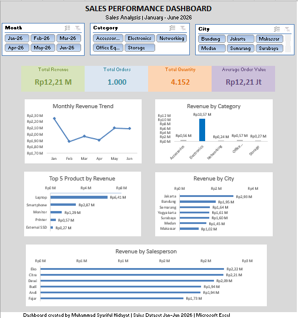

# 📊 Sales Performance Dashboard

## 📌 Project Overview

This project presents an interactive **Sales Performance Dashboard** developed using Microsoft Excel to analyze sales transaction data from January to June 2026.

The dashboard was designed to transform raw sales data into meaningful business insights and provide a concise overview of sales performance across products, categories, cities, and salespersons.

---

## 🎯 Business Objective

The main objectives of this project are to:

* Monitor overall sales performance
* Identify monthly revenue trends
* Analyze revenue contribution by product category
* Identify top-performing products
* Compare revenue performance across cities
* Evaluate salesperson performance
* Provide an interactive dashboard for business performance monitoring

---

## 🛠️ Tools & Skills

* Microsoft Excel
* Data Cleaning
* Data Transformation
* PivotTables
* PivotCharts
* Data Visualization
* Dashboard Development
* Business Analysis

---

## 📊 Dashboard Features

The dashboard provides the following key metrics and analyses:

### Key Performance Indicators

* Total Revenue
* Total Orders
* Total Quantity
* Average Order Value

### Sales Analysis

* Monthly Revenue Trend
* Revenue by Category
* Top 5 Products by Revenue
* Revenue by City
* Revenue by Salesperson

### Interactive Filters

Users can dynamically filter the dashboard by:

* Month
* Category
* City

---

## 🖼️ Dashboard Preview



---

## 🔎 Key Insights

Based on the analysis, several observations can be identified:

* Revenue performance varies across different product categories.
* Electronics contributes the largest share of revenue among the analyzed categories.
* A relatively small number of products contribute significantly to overall revenue.
* Revenue performance differs across cities, indicating variations in regional sales contribution.
* Salesperson performance varies, allowing further evaluation of individual sales contributions.
* Monthly revenue shows fluctuations throughout the January–June period.

---

## 💡 Business Recommendations

Based on the dashboard analysis, several actions could be considered:

1. **Focus on high-performing categories**
   Prioritize products and categories with strong revenue contribution while identifying opportunities to improve lower-performing categories.

2. **Analyze top-performing products**
   Maintain product availability and consider targeted promotional strategies for products generating significant revenue.

3. **Evaluate regional performance**
   Investigate differences in city-level revenue to identify high-potential markets and areas requiring additional sales strategies.

4. **Monitor salesperson performance**
   Use revenue performance as one of the indicators for evaluating sales performance and identifying opportunities for coaching or best-practice sharing.

5. **Monitor monthly trends**
   Track changes in monthly revenue to identify seasonal patterns and support future sales planning.

---

## 📁 Project Structure

```text
sales-performance-dashboard/
│
├── README.md
├── Sales_Performance_Dashboard.xlsx
└── Sales_Performance_Dashboard.png
```

---

## 📌 Project Outcome

This project demonstrates my ability to use Microsoft Excel to transform sales data into an interactive dashboard and communicate data-driven insights from a business perspective.

It is part of my ongoing **Data Analytics portfolio** as I continue developing my skills in data analysis, visualization, and business intelligence.
